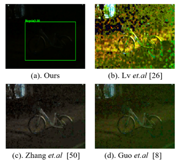
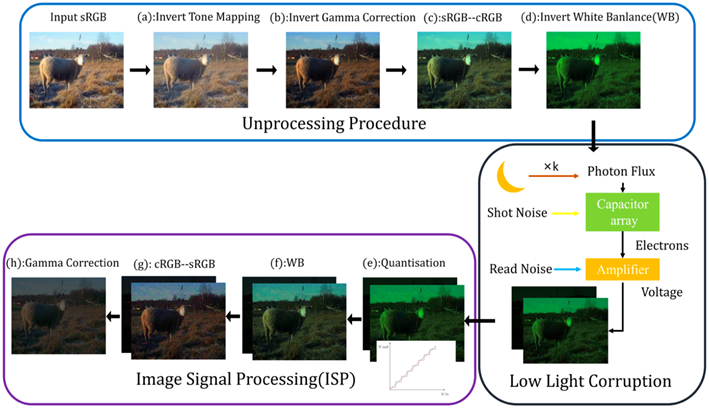

# (ICCV 2021) Multitask AET with Orthogonal Tangent Regularity for Dark Object Detection [(paper)](https://openaccess.thecvf.com/content/ICCV2021/papers/Cui_Multitask_AET_With_Orthogonal_Tangent_Regularity_for_Dark_Object_Detection_ICCV_2021_paper.pdf) [(supp)](https://openaccess.thecvf.com/content/ICCV2021/supplemental/Cui_Multitask_AET_With_ICCV_2021_supplemental.pdf)

**When Human Vision Meets Machine Vision (compare with enhancement methods):** <br/>
 

**Physics-based low-light degrading transformation (unprocess -- degradation -- ISP):**


## Enviroment
```
python 3.7
pytorch 1.6.0
mmcv 1.1.5
matplotlib opencv-python Pillow tqdm
```
## Pre-trained Model
|  dataset   | model  | size | logs |
|  ----  | ----  | ----  | ----  |
| COCO  | ([google drive](https://drive.google.com/file/d/1thYimz_ciMFaZ03ICv61NfFZNnzRbcPN/view?usp=sharing)) ([baiduyun](https://pan.baidu.com/s/1A79a9377A7_zjf-vQYRHdw), passwd:1234) | 489.10 MB | - |
| EXDark  | ([google drive](https://drive.google.com/file/d/1thYimz_ciMFaZ03ICv61NfFZNnzRbcPN/view?usp=sharing)) ([baiduyun](https://pan.baidu.com/s/1Mrh_sOzXHhDo3Bk3inMiOg), passwd:1234) | 470.26 MB | [google drive](https://drive.google.com/file/d/1jU6lcjfQ5DuxThzGX2A_e-bPdBzJKaAT/view?usp=sharing) |

## Pre-process
**Step-1:** Download [COCO 2017 dataset](https://cocodataset.org/#download) and download [EXDark dataset](https://github.com/cs-chan/Exclusively-Dark-Image-Dataset)

**Step-2:** Transform label format to VOC format:
```
python txt2xml.py --data_dir [your exdark path]
```

**Step-3:** Change the data place [line1](https://github.com/cuiziteng/MAET/blob/e7a23bce5cbfc089aafff205afa402f75823706e/configs/MAET_yolo/maet_yolo_exdark.py#L56) and [line2](https://github.com/cuiziteng/MAET/blob/e7a23bce5cbfc089aafff205afa402f75823706e/configs/MAET_yolo/maet_yolo_coco_ort.py#L63) to your own COCO and EXDark path.

## Testing
Testing on (low-light) COCO dataset
```
python tools/test.py configs/MAET_yolo/maet_yolo_coco_ort.py [COCO model path] --eval bbox --show-dir [save dir]
```
Testing on EXDark dataset
```
python tools/test.py configs/MAET_yolo/maet_yolo_exdark.py  [EXDark model path] --eval mAP --show-dir [save dir]
```

## Training
**Setp-1:** Pre-train MAET-COCO model (273 epochs on 4 GPUs): (if use other GPU number, please reset learining rate)
```
CUDA_VISIBLE_DEVICES=0,1,2,3 PORT=[port number] bash ./tools/dist_train_maet.sh configs/MAET_yolo/maet_yolo_coco_ort.py 4
```
**Setp-2:** Fine-tune on EXDark datastet (25epoch on 1 GPU): 
```
python tools/train.py configs/MAET_yolo/maet_yolo_exdark.py --gpu-ids [gpu id] --load-from [COCO model path]
```

### Newly MAET-YOLO results on EXDark dataset (0.776 more than our paper's results):
| class     | gts  | dets | recall | ap    |
|  ----  | ----  | ----  | ----  | ----  |
| Bicycle   | 212  | 761  | 0.920  | 0.834 |
| Boat      | 289  | 984  | 0.896  | 0.785 |
| Bottle    | 282  | 1195 | 0.879  | 0.758 |
| Bus       | 135  | 319  | 0.970  | 0.928 |
| Car       | 597  | 1685 | 0.918  | 0.835 |
| Cat       | 183  | 543  | 0.885  | 0.738 |
| Chair     | 466  | 2057 | 0.839  | 0.706 |
| Cup       | 366  | 1116 | 0.885  | 0.792 |
| Dog       | 207  | 605  | 0.918  | 0.803 |
| Motorbike | 233  | 866  | 0.871  | 0.764 |
| People    | 1562 | 4136 | 0.896  | 0.801 |
| Table     | 333  | 1920 | 0.796  | 0.563 |
| mAP       |      |      |        | **0.776** |

## Citation
```
@InProceedings{Cui_2021_ICCV,
    author    = {Cui, Ziteng and Qi, Guo-Jun and Gu, Lin and You, Shaodi and Zhang, Zenghui and Harada, Tatsuya},
    title     = {Multitask AET With Orthogonal Tangent Regularity for Dark Object Detection},
    booktitle = {Proceedings of the IEEE/CVF International Conference on Computer Vision (ICCV)},
    month     = {October},
    year      = {2021},
    pages     = {2553-2562}
}
```

**The code is largely borrow from mmdetection and unprocess, Thx to their wonderful works~** <br/>
MMdetection: [mmdetection](https://mmdetection.readthedocs.io/en/latest/) ([v2.7.0](https://github.com/open-mmlab/mmdetection/tree/v2.7.0)) <br/>
Unprocessing Images for Learned Raw Denoising: [unprocess](https://github.com/timothybrooks/unprocessing)
